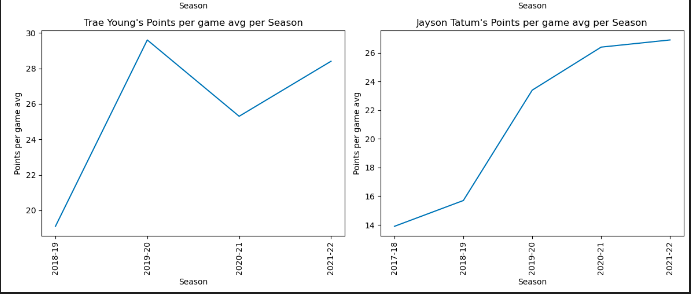

# **Final Report**

## **Introduction:** 

The Project we have been diligently working on requires conducting data research, where we find an intriguing dataset for further exploration. Our process involves formulating research questions that challenge us to wrangle, extract, and manipulate the dataset, while also creating visual diagrams to address these questions and gain insights from the dataset. As a group, we were highly motivated to undertake this project due to our interest in basketball from a young age, which led to closely following the NBA. Now that we have the opportunity to thoroughly analyze NBA stats, we are enthusiastic about uncovering answers to the questions we had prior to the announcement of this project.

 

# EDA (Exploratory data analysis)

### **Observation**

- the FT% for 1994 was the lowest value with 72%.

- Huge down trajectory on the graph from 1991-1994

- from 1999 -2016 seem to have a rising slope. 

### **Observations** 

* Vince Carters has the most season played in the NBA ever, to play a sport of the highest level for over 2 decades is impressive 
 
* Other than 2 people, no one else in the NBA has made it over 20 seasons. 

### **Observation** 
* The plotted points are all within 10 points of each other. 

* the trajectory of the trend line it facing the top right corner of the graph indicating that as time passes, the more average points the player score.

 

### Observations 

- It is clear Lebron has a large lead over everyone else 
- Durant is closest but is only four years younger with over 10 000 less points
- However players like Luka,Jayson and Trae are still very young and have an impressive number of points

### Observations

- Lebron is more efficient now then he was in every other season except from 2012-2014
- 60% seems to be a mean across the players
- Kevin Durant appears to be the most efficient of the bunch but not by a large margin

# Question + Results (Adam Delfs)

**Lebron James has had a one of a kind career, his latest greatest accolade being beating Kareem Abdul Jabbar's long standing all-time points record. Is any other active player capable of beating Lerbons Record?**

### Summary 
The scatter plot shows a comparison of the total number of games played and total points Scored. LeBron James stands out as the player who has played the most games and scored the most points among the selected players by far . Other players such as Stephen Curry, Kevin Durant, and James Harden are close but still nowhere near LeBron James, however they have fewer games played. Trae Young and Luka Doncic have  similar total point values per game played, indicating they may have a high potential to have a  higher total point values with more games played. The Biggest Takeaway from this Graph is how diificult a record it will be to break.

### Summary 
This is a collection of line plots of each players points per game averages in each season they played, this is helpful for demonsrating consistency and progresssion. This Graph lends us much information. Lebron Has not been extremely consistent but his points per game in his 2021-22 season came close to his all time peak showing lonegevity. James Harden had a steep drop off after the 2018-2019 season which is not a great sign in terms of beating lebrons record even though he is the second closest currently.Giannis has been consistenly improving since his first season which makes him a top canidate to take the top spot (Same goes for Jayson tatum).  Luka and Trae have similar PPG to Lebron in their first two seasons which make them another two canidates.  

# Question + Results (Regan Nguyen)

**Due to the progression of health science, NBA players have gotten stronger, faster, more accurate and more athletic in general. How has that affected scoring in the NBA?**

### Description
 this is a box plot that plots the top ten best scorers' averages, of each season. Using this graph. We are using box plots because you can get high-level information such as the first quartile, median, third quartile, outliers, and maximum values just at a glance. We can see that as the later season goes by the median of each season seems to go up, and the boxes in the graph that represent the quartiles is smaller, suggesting that the level gap of players seems to be closer. The boxes of the later seasons seem to start higher which indicates that the players as a whole in the NBA, scores more points recently.

### Description
This is a line plot of the average of the top ten best scorers average of each season from 1996-2022, using this graph we can easier compare each seasons average of the line graph connects to one another. Observing the graph, we can see the top players of each season and thre average. We can see that from the season 2011-2012 to 2021-2022 the graph shows a upwards slop with the peek of the whole graph in 2019-2020 with 30 pts average. This indicates that this is the highest players ever averaged. 

### Description
This is a joint plot graph with the x value being the seasons while the y value being the average of the top ten best scorers average of each season. The main area is a scatter plot with a regression line so we can see the trajectory of the plots. the side graphs are histograms of the marginal distributions. In most seasons, the average point falls between 25 pts and 26 pts based on the histogram graph that shows the marginal distribution Based on the regression line we can see that it's at a positive slope thus indicating that players are scoring more points after each season on average.

 

# Summary/Conclusion:

 ### Regan
 I conducted a study to examine the impact of player athleticism on scoring in the NBA over the years. By wrangling, manipulating, and making visuals of the dataset, I believe that I have an answer to my question. The results consistently showed that scoring has increased over the seasons. The box plot revealed an upward trend in median scoring and lower quartile scores. The line graph displayed the highest average of the top 10 players, which was recently achieved and surpassed the previous peak by 2 points. Additionally, the joint plot depicted a positive regression slope, indicating that the top 10 scorers of each season are on an incline. These findings collectively suggest that scoring in the NBA has been on the rise as player athleticism has improved.
 
[You can find the full analysis notbook here, including the code and the data here](analysis/analysis2.ipynb)

### Adam
The Culmination of this All leads me to the conclusion that LeBron Jame’s All time scoring record is an extremely difficult one to beat. LeBron achieved it through a combination of high volume shot taking, consistency as well as longevity. Beating this record may be possible but there is an absolute Goliath of a player in their way with a huge lead. All the while, LeBron is still playing increasing the record each game. Kevin Durant is the closest despite still being over 10 000 points behind but could have been a lot closer if he takes more shots. James Harden would have had a shot if he had remained consistent in his scoring. Players such as Giannis Antetokounmpo  and Jayson Tatum still have a shot if they continue to increase their points per game averages each season as they have been. The young guns, Luka Doncic and Trae Young have the best chance based on their current scoring practices but they will need to maintain them for a very long time. Overall, it is clear that in order to beat one of the greatest players of all time you will need to put in 110% in and more. Through this project I gained a further insight into the NBA, as well as learned valuable skills such as data wrangling and selection as well as creating effective and aesthetic visualizations. 

[You can find the full analysis notbook here, including the code and the data here](analysis/analysis1.ipynb)